# Custom ESPHome Tuya Component (55 55 AA Variant)

## Overview

This project contains a **custom override of the ESPHome Tuya component** to support a non-standard Tuya MCU protocol variant.

The device uses a modified communication format that is **not compatible with the default ESPHome Tuya implementation**, requiring changes at the C++ level. You can check the `tuya.cpp.diff` to understand the changes.

---

## Why This Exists

The original ESPHome Tuya component assumes the standard Tuya protocol:

* Header: `55 AA`
* Checksum: sum of all bytes

However, this device uses a **custom variant**:

* Header: `55 55 AA`
* Checksum: `(sum of bytes excluding header) - 1`

Because of this:

* ESPHome rejects all incoming messages
* Device fails to initialize
* No datapoints are received

This custom component fixes:

* Header parsing
* Message offsets
* Checksum calculation

---

## Supported Device

This was built specifically for:

* **Tuya Product ID:** `nwfyp1mbfgtvx2tr`
* **Model:** `SYZN119`
* **Chip:** CB2S (BK7231N)
* **Device Type:** Towel Rack Warmer (Thermostat)

---

## Datapoints Notes

During reverse engineering, most datapoints were successfully identified and mapped.

However:

* **Datapoint 4 (DP4)** is still **unknown**
* It is reported by the MCU as an **enum value**
* Its behavior and meaning have not yet been determined

For this reason, it is intentionally exposed in ESPHome as:

```
DP4 Debug
```

This allows:

* Observing value changes in real time
* Correlating it with device behavior
* Future reverse engineering without modifying firmware again

---

## What Was Modified

### RX Protocol Changes

* Accepts 3-byte header:

  ```
  55 55 AA
  ```

* Shifts all message offsets by +1

* Adjusts payload parsing accordingly

### Checksum Fix

Original ESPHome:

```
checksum = sum(all bytes)
```

Custom implementation:

```
checksum = (sum(bytes[3..])) - 1
```

---

## Project Structure

```
.
├── towel-rack.yaml
└── components/
    └── tuya/
        ├── tuya.cpp   (modified)
        ├── tuya.h
        └── ...
```

---

## How to Use

### 1. Copy Component

Place the `tuya` folder inside:

```
components/tuya/
```

---

### 2. Enable External Component

In your ESPHome YAML:

```yaml
external_components:
  - source: github://carnei-ro/esphome-custom-tuya-component
    components: [tuya]
```

---

### 3. Build

```bash
esphome run towel-rack.yaml --clean
```

---

## Notes

* This overrides the built-in ESPHome Tuya component
* It is **device-specific** and may not work with standard Tuya devices
* Keep this component if your device uses the same protocol variant

---

## Future Improvements

* Identify and document DP4 behavior
* Add auto-detection between standard and custom Tuya protocol
* Make checksum behavior configurable
* Upstream support if more devices use this format

---

## Credits

Reverse-engineered and implemented through UART debugging and protocol analysis.

---

## Device Photos

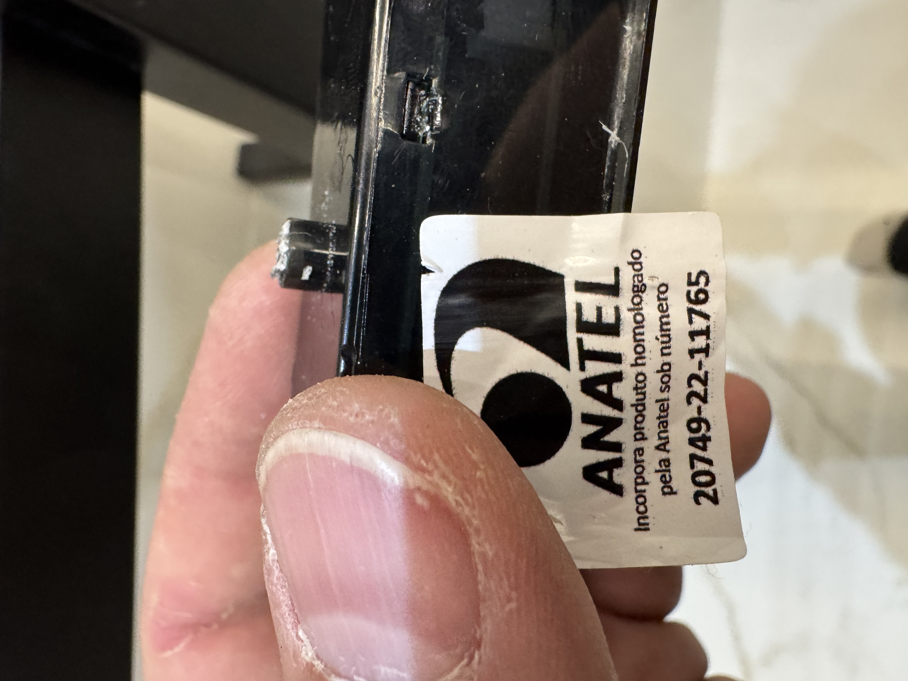
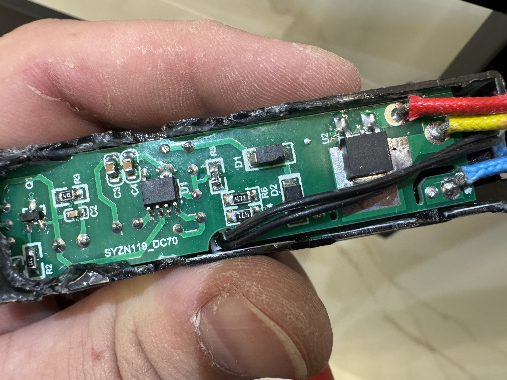
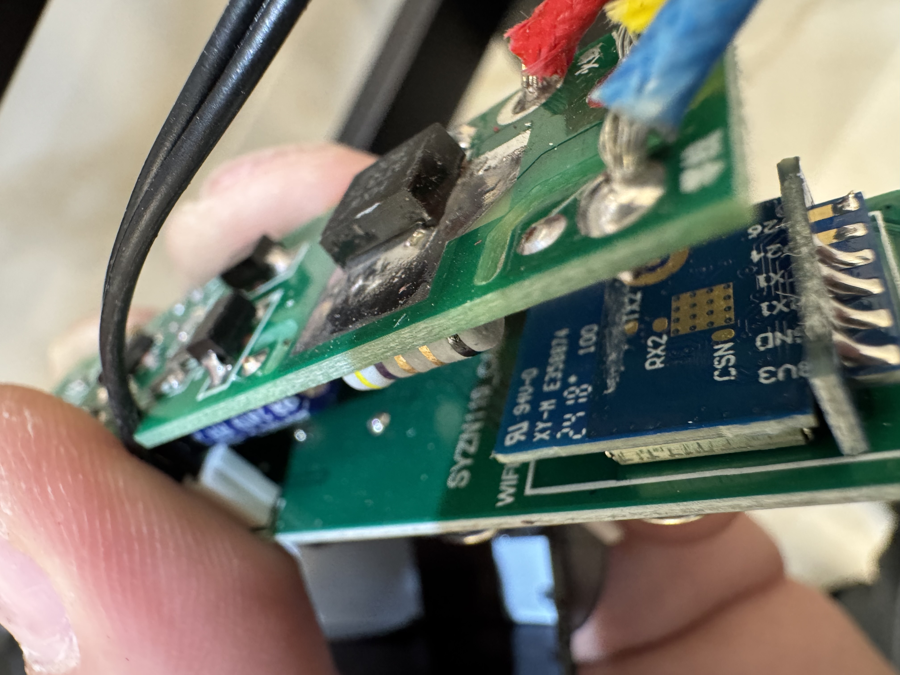
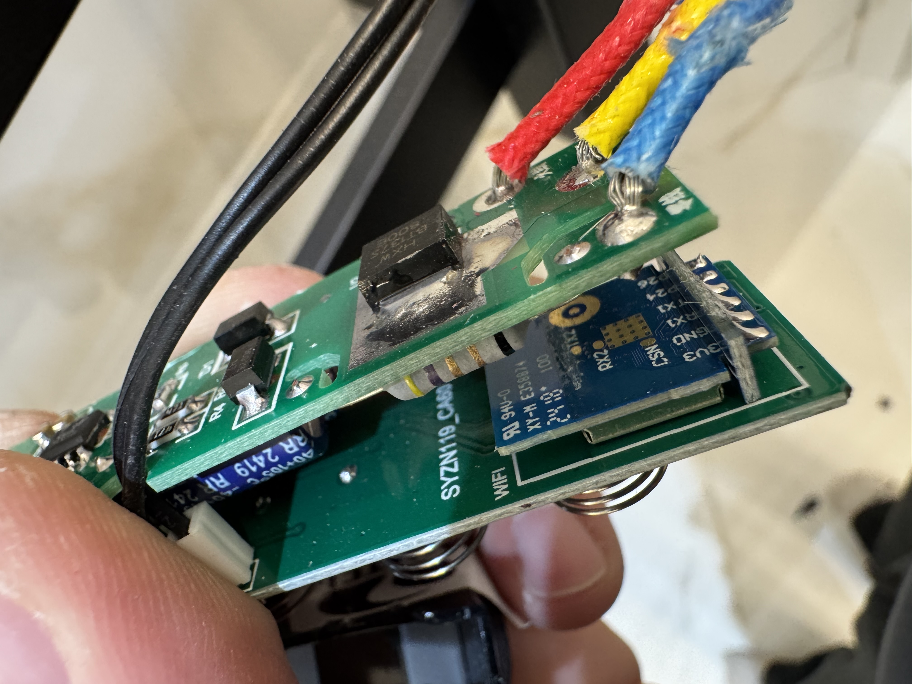
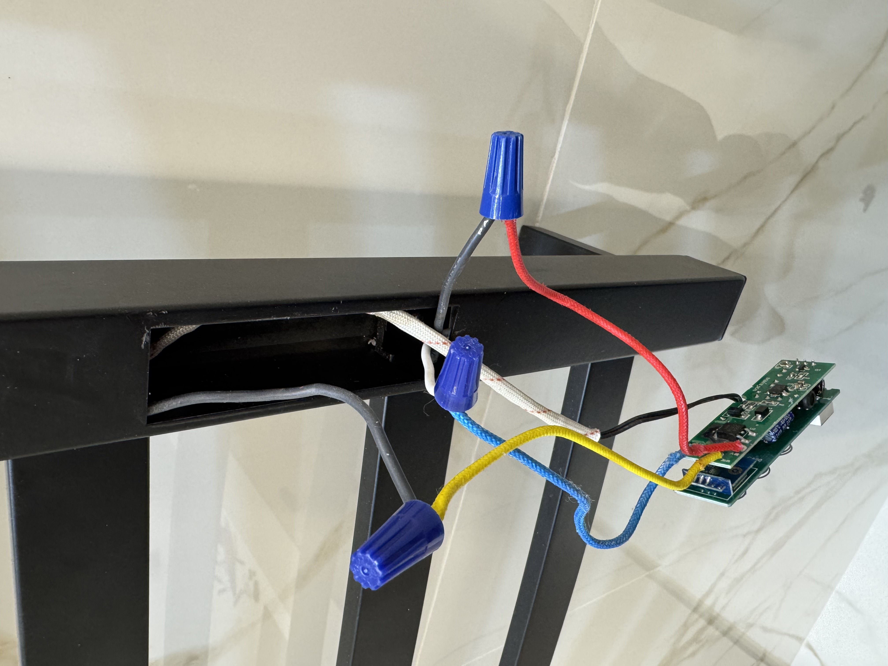
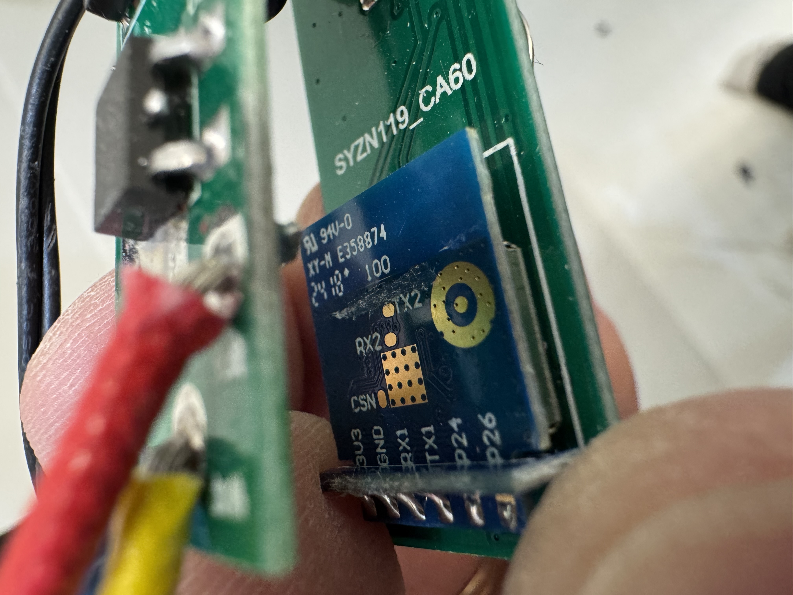
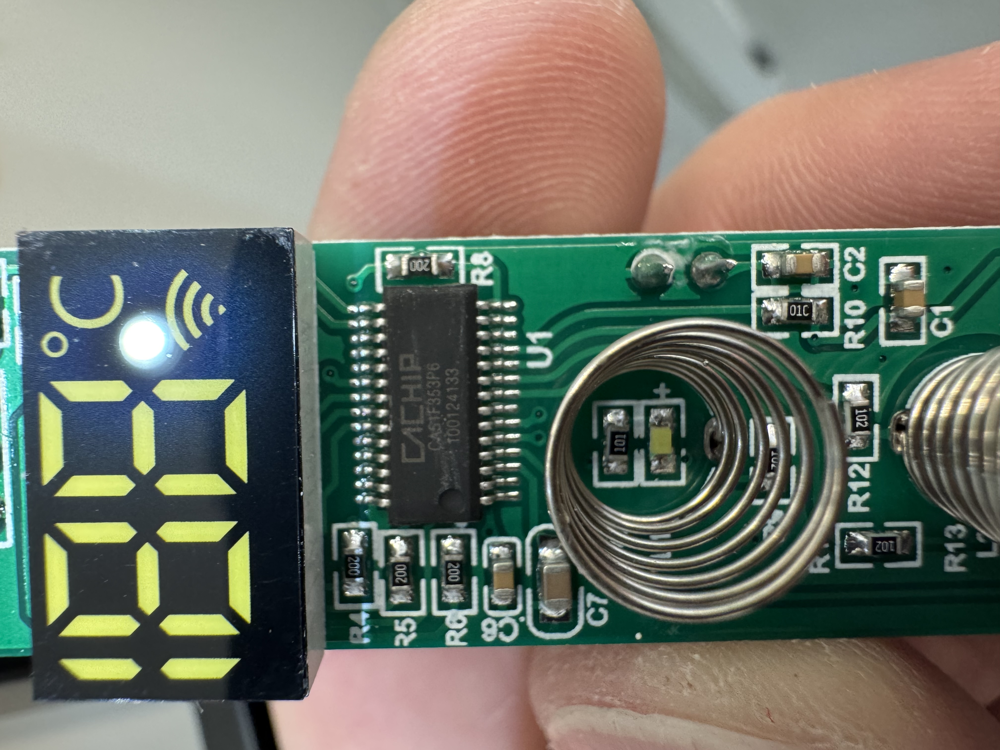
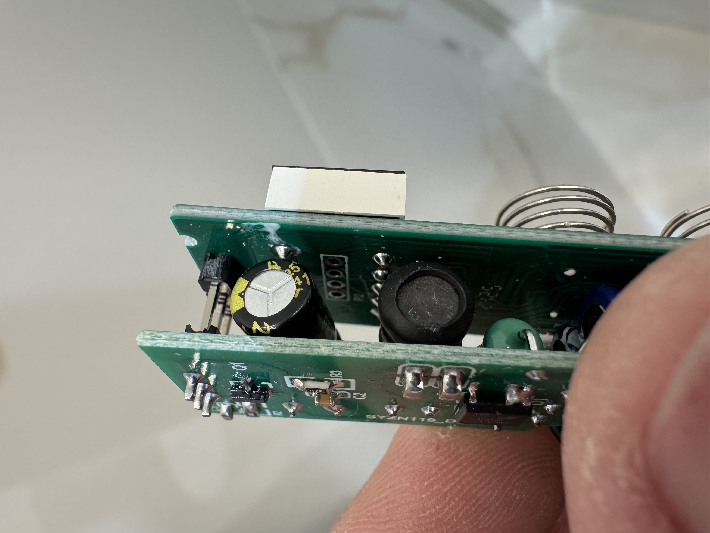
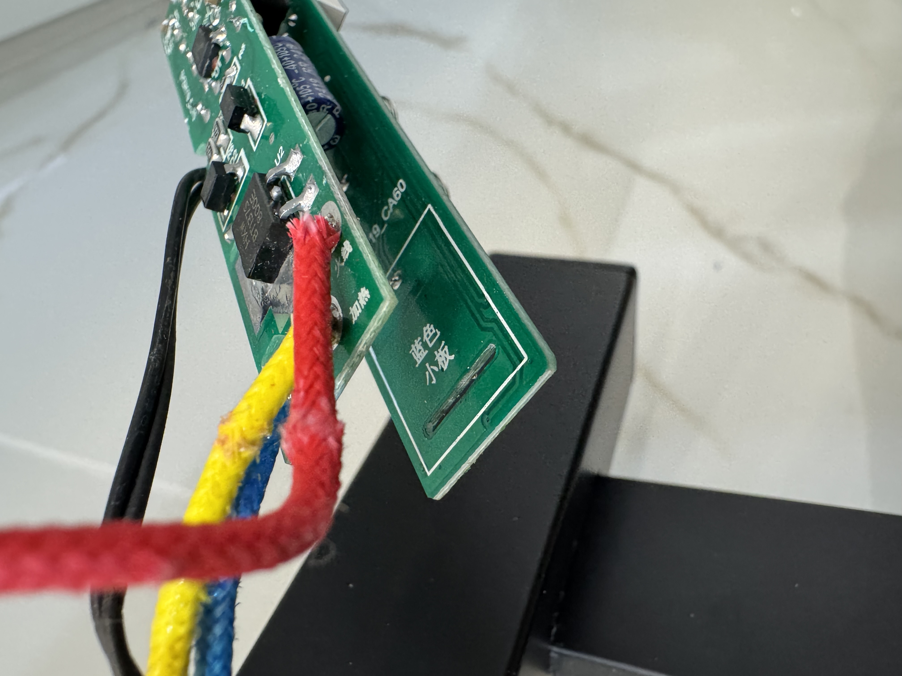
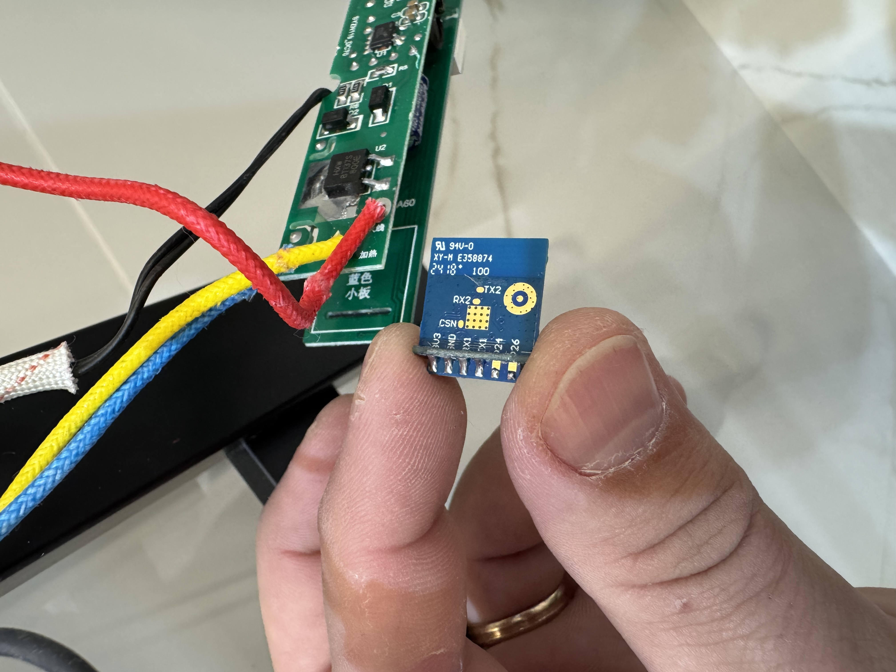
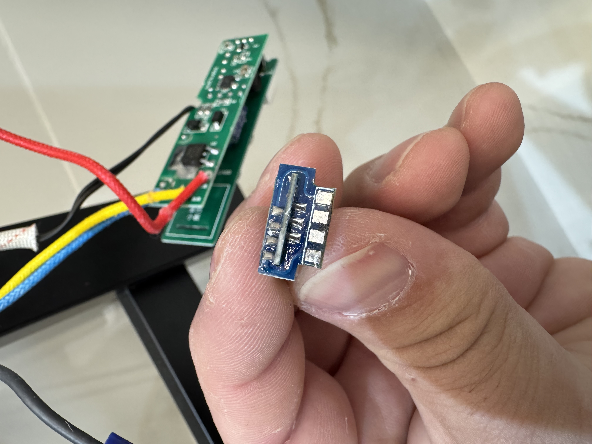
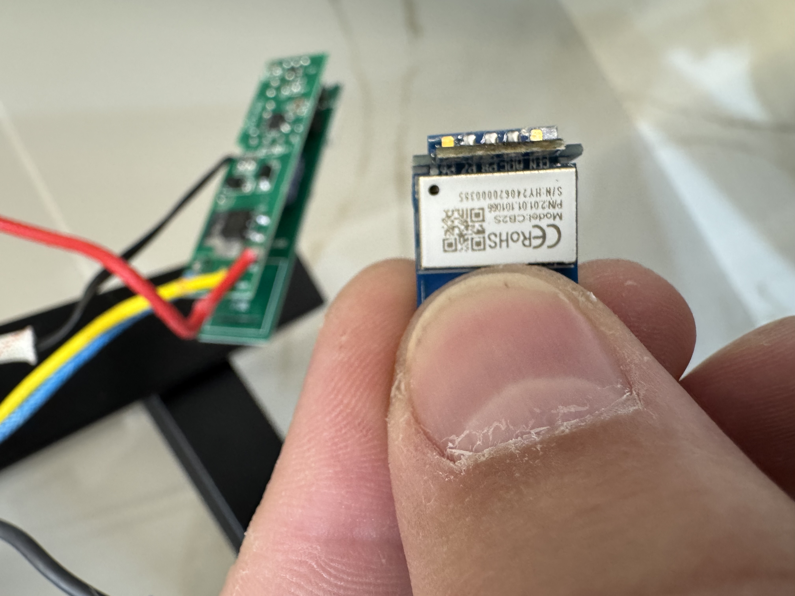
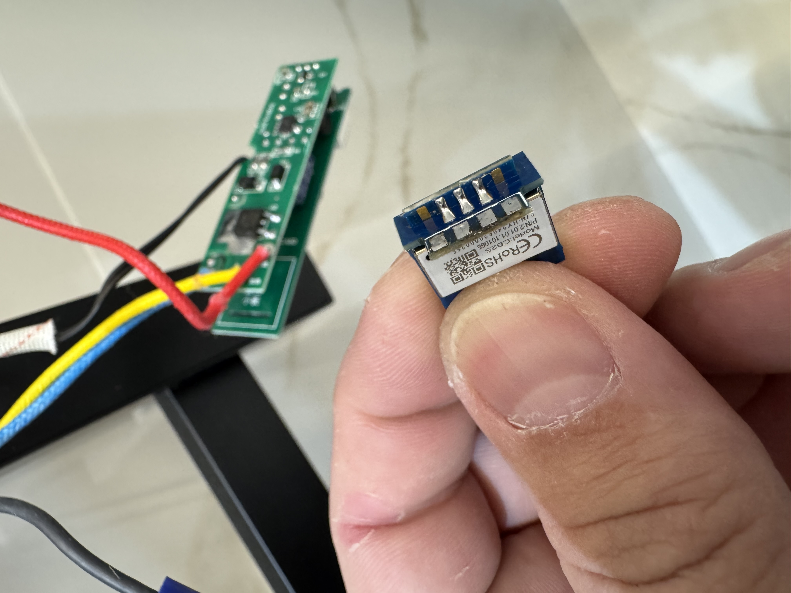